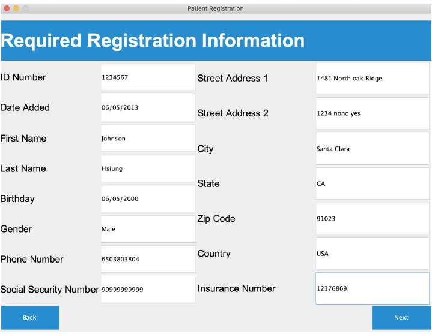

# S20-CS151--3--Team-13-
Run the main method in PatientController. 

Notes:
Required Input Registration: All fields in here are required. It will not allow you to goto the next page if some fields are not inputted.  

Table: Information presented in tables can be edited directly. If after editing information, the cell is white, press enter so it turns blue. After, press “Update” in the center to update the information. 

List: You have to select an object in the list to go to pages containing information of that category. 

Below is the general flow of the program.

Home screen: 

Upon pressing "Register New Patient," a four step process to register a new patient will start. This first page is for required information.

Upon pressing "Finish," the user will be navigated back to the home screen, with the option of undoing the recently added patient in case of a mistake. 

Upon pressing "View Patients," the database of patients will appear.

Upon selecting a patient and pressing "Info," the patient's information will be displayed.

Upon pressing "Medication," the patient's medication details will be shown.

Upon selecting a specific medication, information about that medication will be displayed.

Press "Back" to return to the patient database home screen.

Upon selecting a patient and pressing "+ Add Visit," a three-step process for entering the necessary visit information will begin.

Upon pressing "Finish," the user will be navigated back to the patient database home screen.

Upon selecting a patient and pressing "Visit History," that patient's visit history will be displayed.

Upon selecting a visit and pressing "Info" or "View Evaluation," the corresponding information, with the option to edit, will be shown.

Press "Back" to return to the patient database home screen.

Upon selecting a patient and pressing "Schedule Visit," a pop-up prompt will appear.

 

